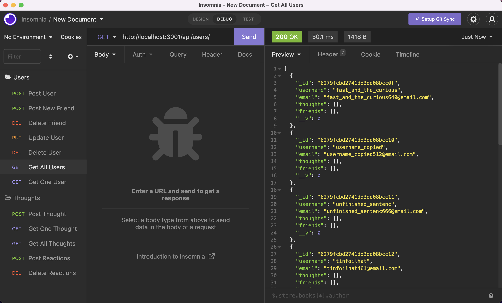

# Super Simple Social Network API
A Simple MongoDB ORM Excercise Built with Mongoose on Node.js

&nbsp;  

---

## Table of Contents:

- [Installation](#installation)
- [Description](#description)
- [Usage](#usage)
- [License](#license)
- [Contributing](#contributing)
- [Tests](#tests)
- [Questions](#questions)

---

## Installation:
You must have [MongoDB installed](https://www.mongodb.com/cloud/atlas/register) on your machine.

You must also have [node installed](https://nodejs.org/en/download/) on your machine in order to run this app. Run the command `npm i` to install dependencies, which include:

- [ ] mongoose
- [ ] express


&nbsp;  

---


## Description:

This simple API allows basic CRUD operations for a theoretical social network (no UI currently offered for the app).



### Models
(see [Mongoose's Documentation](https://mongoosejs.com/docs/) for more on the schema setup below)

**User Model Schema**:

* `username`
  * String
  * Unique
  * Required
  * Trimmed

* `email`
  * String
  * Required
  * Unique
  * Validation ensures that input is a valid email address format

* `thoughts`
  * Array of `_id` values referencing the `Thought` model (see below)

* `friends`
  * Array of `_id` values referencing the `User` model (self-reference)

---

**Thought Model Schema**:

* `thoughtText`
  * String
  * Required
  * Validation enforces length between 1 and 280 characters

* `createdAt`
  * Date
  * Default value of the current timestamp
  * Getter method formats the timestamp on query

* `username` (The user that created this thought)
  * String
  * Required

* `reactions` (These are like replies)
  * Array of nested documents created with the `reactionSchema`

  **Reaction Model Schema** (SCHEMA ONLY)

* `reactionId`
  * ObjectId data type
  * Default value is set to a new ObjectId

* `reactionBody`
  * String
  * Required
  * 280 character maximum

* `username`
  * String
  * Required

* `createdAt`
  * Date
  * Default value of the current timestamp
  * Getter method formats the timestamp on query

---

### API Routes

**`/api/users`**

* `GET` all users

* `GET` a single user by its `_id` and populated thought and friend data

* `POST` a new user:

```json
// example data
{
  "username": "lernantino",
  "email": "lernantino@gmail.com"
}
```

* `PUT` to update a user by its `_id`

* `DELETE` to remove user by its `_id` (also removes all thoughts associated with a user)

---

**`/api/users/:userId/friends/:friendId`**

* `POST` to add a new friend to a user's friend list

* `DELETE` to remove a friend from a user's friend list

---

**`/api/thoughts`**

* `GET` to get all thoughts

* `GET` to get a single thought by its `_id`

* `POST` to create a new thought (don't forget to push the created thought's `_id` to the associated user's `thoughts` array field)

```json
// example data
{
  "thoughtText": "Here's a cool thought...",
  "username": "lernantino",
  "userId": "5edff358a0fcb779aa7b118b"
}
```

* `PUT` to update a thought by its `_id`

* `DELETE` to remove a thought by its `_id`

---

**`/api/thoughts/:thoughtId/reactions`**

* `POST` to create a reaction stored in a single thought's `reactions` array field

* `DELETE` to pull and remove a reaction by the reaction's `reactionId` value


&nbsp;  

---
## Usage:

For a complete walkthrough of this API, check out *[this video link](https://youtu.be/Iua_372QDkI).*


To report a bug or suggest improvements to the user experience, see the [questions section](#questions) below.

&nbsp;  

---
---
#### *License:*

[](https://opensource.org/licenses/MIT)

&nbsp;  

---
#### *How to Contribute:*

Please see the contact information in the ‘Questions’ section.

&nbsp;  

---

#### *Tests:*

No tests have been deployed at this time.

&nbsp;  

---

#### *Questions?*

[Find me on GitHub: jonathan-warkentine](https://github.com/jonathan-warkentine)

Or send an email: [jonathan.warkentine@gmail.com](mailto:jonathan.warkentine@gmail.com)

### Outstanding Improvements/Bug Fixes
- [ ] Getter method formats the timestamp on query